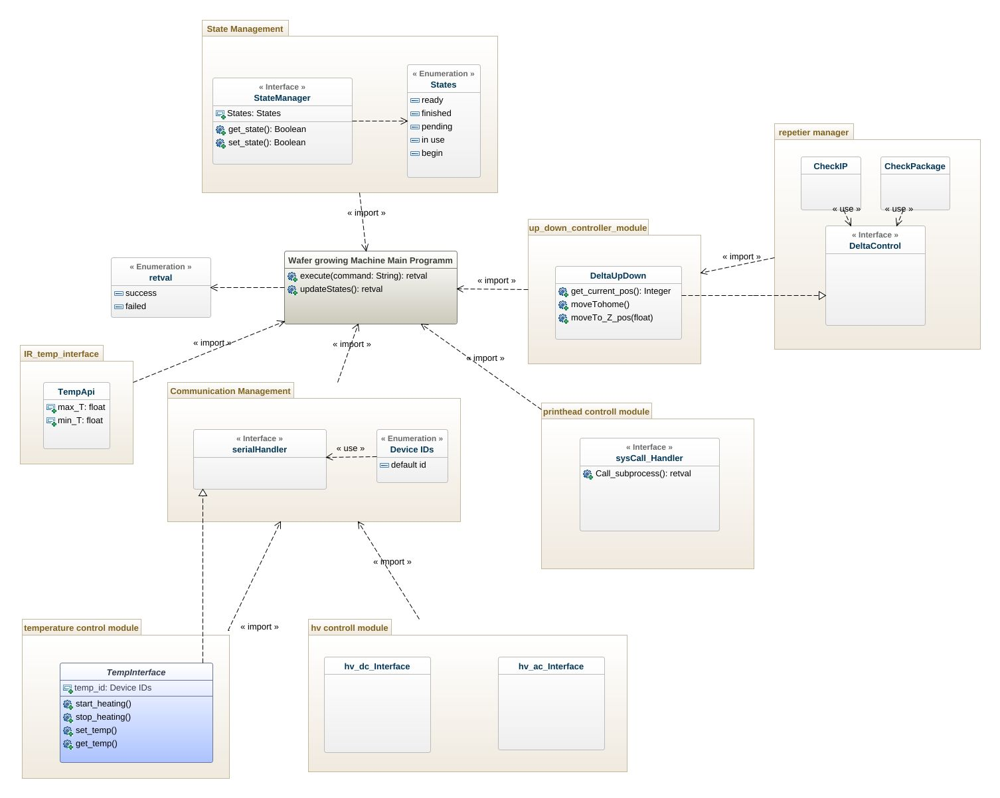

# GenMyModel

There is a first version of the UML class diagramm of the system in python. 

This diagramm was created with the online tool:  GenMyModel

You find all relevant Data to this Tool inside [GenMyModel](https://app.genmymodel.com/api/dictionary/projects/_cGFRUGyMEeyzq6ra3GZCdA) folder.

below is the uml class diagram  

You can contribute [here](https://app.genmymodel.com/api/dictionary/projects/_cGFRUGyMEeyzq6ra3GZCdA)

The code generated by this tool are found [here](GenMyModel/Machine_model)